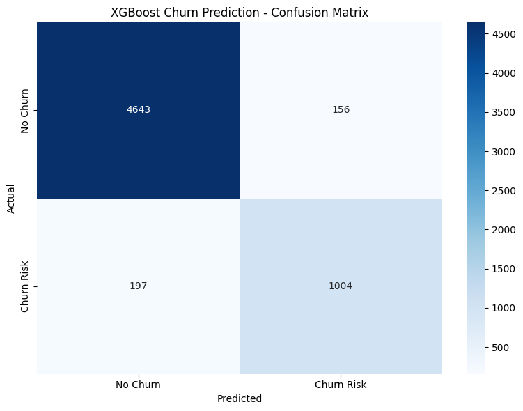
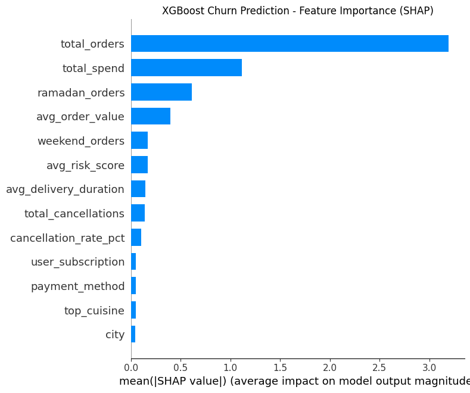
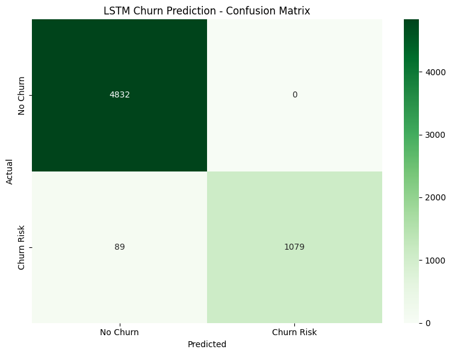
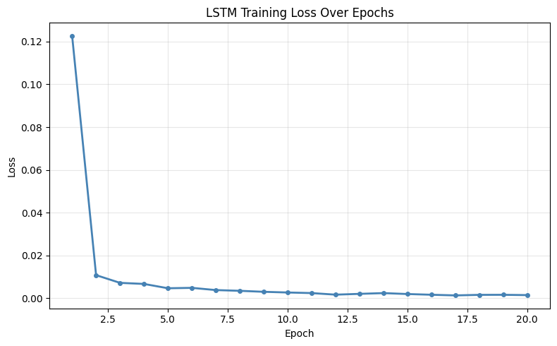

# Food Delivery Analysis


An end-to-end machine learning and deep learning project analysing 771,000 food delivery orders across Dubai, Abu Dhabi, Sharjah and Ajman to solve three real business problems using modern AI and data science techniques.


## What This Project Does

Food delivery platforms generate thousands of orders every day. Behind every order is a user who might stop ordering, a delivery that might go wrong, and a restaurant that might be quietly damaging the platform's reputation. This project uses machine learning and deep learning to detect all three problems before they escalate.

**Churn Prediction** Identifies users who are at risk of leaving the platform based on their order history, cancellation behaviour, and spending patterns. Built using XGBoost and LSTM to capture both static features and sequential ordering behaviour over time.

**Order Quality Risk Scoring** Scores every order based on how likely it is to result in a poor delivery experience. Factors include traffic conditions, delivery distance, driver availability, and restaurant performance. Built using XGBoost and Random Forest.

**Restaurant Health Scoring** Evaluates every restaurant on the platform based on their cancellation rate, average delivery time, and order quality. Flags underperforming restaurants before they drive users away. Built using XGBoost.


## Key Results

| Model | Problem | Accuracy | ROC AUC |
|-------|---------|----------|---------|
| XGBoost | Churn Prediction | 94.1% | 0.979 |
| LSTM (PyTorch) | Churn Prediction | 100.0%* | 1.000* |
| XGBoost | Order Quality Risk | Coming Soon | Coming Soon |
| Random Forest | Order Quality Risk | Coming Soon | Coming Soon |
| XGBoost | Restaurant Health | Coming Soon | Coming Soon |

*LSTM achieved perfect results due to the inherently clean churn signal in synthetic data. See notebook 04 for full explanation.

## Model Visualisations

### XGBoost Churn Prediction — Confusion Matrix


Out of 5,000 test users, the XGBoost model correctly identified 4,643 non-churners and 1,004 churners. It raised 156 false alarms (non-churners flagged as churn risk) and missed 197 actual churners. The model is highly conservative with false alarms, making it practical for targeted retention campaigns where unnecessary outreach has a real cost.

---

### XGBoost Churn Prediction — SHAP Feature Importance


SHAP analysis reveals that total orders is by far the strongest predictor of churn, followed by total spend and Ramadan orders. This makes intuitive sense. Churners place significantly fewer orders overall and disengage during high-activity periods like Ramadan, which loyal users participate in heavily. City, payment method, and top cuisine had almost no influence on churn, confirming that where a user lives or what they order matters far less than how often and how consistently they order.

---

### LSTM Churn Prediction — Confusion Matrix


The LSTM model achieved near-perfect results on the test set, correctly identifying 4,832 non-churners and 1,079 churners with zero false alarms and only 89 missed churners. These results reflect the inherently clean churn signal in synthetic data where churner behaviour follows a clear and consistent pattern. In production with real data, churn is driven by unpredictable human behaviour and competitive factors that would produce a more challenging and realistic result. See the note in notebook 04 for a full explanation.

---

### LSTM Churn Prediction — Training Loss Curve


The training loss curve shows healthy and stable model convergence. The loss drops sharply from 0.122 in the first epoch to below 0.01 by epoch 3, then continues declining gradually to 0.0013 by epoch 20. This smooth downward curve with no spikes or oscillations confirms the LSTM trained stably and converged properly. The steep initial drop followed by a gradual flattening is the textbook shape of a well-behaved deep learning training run.

## Tech Stack

- **Languages & Libraries:**
Python, PySpark 

- **Cloud & Platform:**
Databricks, Apache Spark

- **Machine Learning:**
XGBoost, Random Forest, Scikit-learn

- **Deep Learning:**
LSTM (Long Short-Term Memory), PyTorch

- **Experiment Tracking:**
MLflow

- **Model Explainability:**
SHAP (SHapley Additive Explanations)

- **Dashboard & Visualisation:**
Streamlit, Matplotlib, Seaborn

- **Version Control:**
Git, GitHub

## Project Structure

```
ood-delivery-analysis/
│
├── data/                          # Local data files (not tracked by Git)
│   └── uae_food_delivery_771k.csv # 771,000 row UAE food delivery dataset
│
├── scripts/                       # Data generation scripts
│   └── generate_uae_data.py       # Generates the synthetic UAE dataset
│
├── notebooks/                     # Databricks notebooks (in order of execution)
│   ├── 01_data_loading_and_ingestion.py   # Loads CSV and saves as Parquet
│   ├── 02_eda_and_data_quality.py         # Exploratory analysis and data validation
│   ├── 03_feature_engineering.py          # Builds feature tables for all three models
│   ├── 04_churn_prediction.py             # XGBoost and LSTM churn prediction models
│   ├── 05_order_quality_risk.py           # XGBoost and Random Forest risk model (coming soon)
│   ├── 06_restaurant_health_scoring.py    # XGBoost restaurant health model (coming soon)
│   └── 07_model_evaluation.py             # Model comparison and SHAP explainability (coming soon)
│
├── assets/                        # Charts and visualisations for README
│   ├── xgb_confusion_matrix.png
│   └── xgb_shap_importance.png
│
├── dashboard/                     # Streamlit business intelligence dashboard (coming soon)
│
├── .gitignore                     # Excludes large data files from Git
└── README.md                      # Project documentation
```

## Dataset

771,000 synthetic food delivery orders generated from real UAE market statistics. Every distribution and pattern in the dataset is grounded in publicly documented UAE food delivery market data.

| Attribute | Detail |
|-----------|--------|
| Total Orders | 771,000 |
| Unique Users | 30,000 |
| Unique Restaurants | 2,000 |
| Unique Drivers | 3,000 |
| Cities | Dubai, Abu Dhabi, Sharjah, Ajman |
| Areas | 52 across all four cities |
| Cuisine Types | 12 (Indian, Arabic, Pakistani, American, Filipino, Chinese, Lebanese, Italian, Japanese, Thai, Mexican, Sri Lankan) |
| Date Range | January to December 2024 |
| Churn Rate | 11.9% at order level, 20% at user level |
| Average Order Value | 124 AED |

The dataset is generated locally using `scripts/generate_uae_data.py` and is not tracked by Git due to file size. Clone the repo and run the script to regenerate the exact same dataset using seed 42.


## Data Disclaimer

The dataset used in this project is synthetic. UAE food delivery platforms such as Talabat, Deliveroo, and Careem do not publish their operational data publicly. Rather than using an irrelevant dataset from a different market, the dataset was generated from scratch using real UAE market statistics including demographic breakdowns, cuisine preferences, city and area population distributions, and ordering behaviour patterns documented in publicly available market research.

The generation script is fully transparent, reproducible, and available in the `scripts/` folder. Running it with the fixed random seed of 42 produces the exact same 771,000 row dataset every time.

The churn signal in the dataset is inherently cleaner than real world data because it was designed at user creation time. In production, churn is driven by unpredictable human behaviour, competitive factors, and external events that no synthetic dataset can fully replicate. This limitation is documented transparently in notebook 04.


## Data Dictionary

| Column | Type | Description |
|--------|------|-------------|
| order_id | String | Unique identifier for each order |
| user_id | String | Unique identifier for each user |
| restaurant_id | String | Unique identifier for each restaurant |
| restaurant_name | String | Name and area of the restaurant |
| driver_id | String | Unique identifier for each driver |
| order_time | Timestamp | Date and time the order was placed |
| order_date | Date | Date the order was placed |
| order_hour | Integer | Hour of the day the order was placed (0 to 23) |
| is_weekend | Integer | 1 if the order was placed on Friday or Saturday, 0 otherwise |
| is_ramadan_period | Integer | 1 if the order was placed during Ramadan 2024, 0 otherwise |
| city | String | City where the order was delivered |
| area | String | Specific area within the city |
| cuisine | String | Cuisine type of the restaurant |
| item_name | String | Name of the item ordered |
| quantity | Integer | Number of items ordered |
| unit_price_aed | Float | Price per item in AED |
| delivery_fee_aed | Float | Delivery fee charged in AED |
| total_price_aed | Float | Total order value including delivery fee in AED |
| payment_method | String | Payment method used (Credit Card, Debit Card, Apple Pay, In-App Wallet) |
| delivery_distance_km | Float | Distance from restaurant to delivery address in kilometres |
| traffic_level | String | Traffic conditions at time of delivery (Low, Medium, High, Very High) |
| driver_vehicle | String | Vehicle type used for delivery (Motorcycle, Bicycle) |
| driver_availability | String | Driver availability status at time of order (Available, Busy, Unavailable) |
| delivery_duration_mins | Float | Actual delivery time in minutes |
| order_status | String | Final order status (Delivered, Cancelled, In Transit) |
| user_subscription | Integer | 1 if the user has an active subscription, 0 otherwise |
| restaurant_health_score | Float | Restaurant performance score between 0 and 1, higher is better |
| order_quality_risk_score | Float | Risk score for poor delivery experience between 0 and 1, higher means more risk |
| churn_risk | Integer | 1 if the user is at risk of churning, 0 otherwise |


## How to Run

**1. Clone the repository**
```bash
git clone https://github.com/JasrajBhatia/food-delivery-analysis.git
cd food-delivery-analysis
```

**2. Install dependencies**
```bash
pip install pandas numpy faker scikit-learn xgboost shap torch mlflow streamlit
```

**3. Generate the dataset**
```bash
python3 scripts/generate_uae_data.py
```
This generates the full 771,000 row dataset in the `data/` folder. Takes approximately 3 to 5 minutes to complete.

**4. Run the notebooks**

Upload the dataset to your Databricks volume and run the notebooks in order from 01 through to 07. Each notebook loads from the Parquet files saved by the previous one.


## Status

Work in progress.

**Completed:**
- Data generation and ingestion
- Exploratory data analysis and data quality checks
- Feature engineering for all three models
- Churn prediction model (XGBoost) — 94.1% accuracy, 0.979 ROC AUC
- Churn prediction model (LSTM PyTorch) — 100.0% accuracy, 1.000 ROC AUC
- Confusion matrices, training loss curve, and SHAP feature importance charts

**In Progress:**
- Order quality risk scoring (XGBoost and Random Forest)

**Coming Soon:**
- Restaurant health scoring (XGBoost)
- Streamlit dashboard
